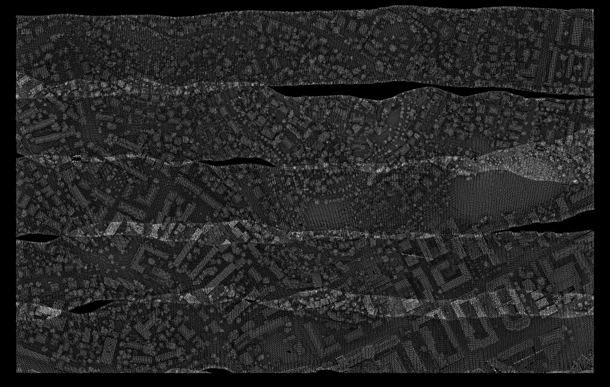
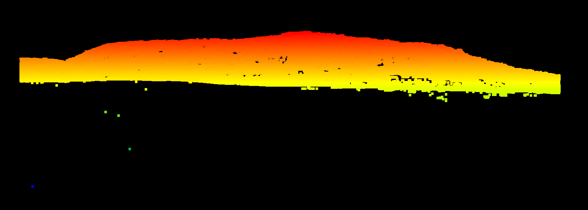
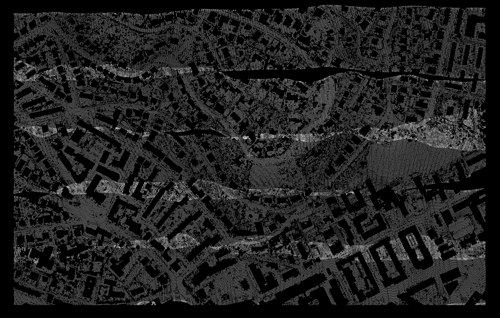
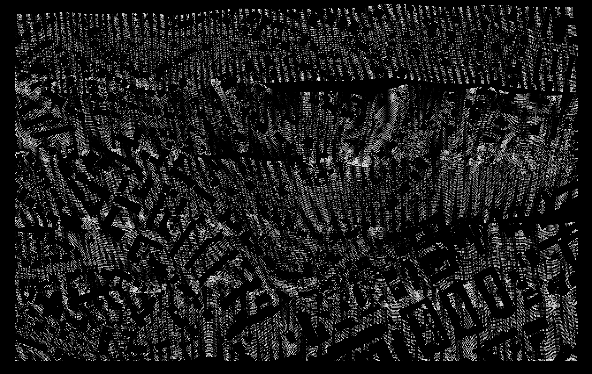
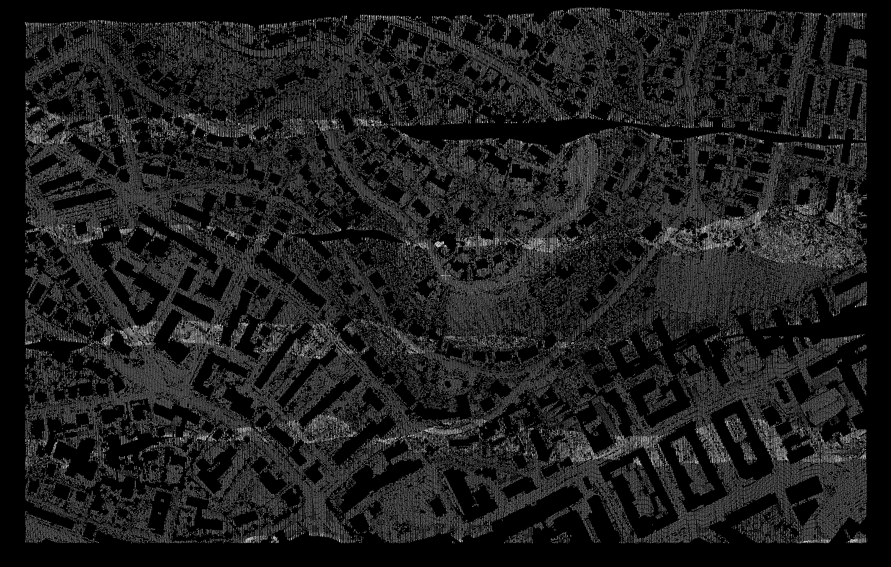
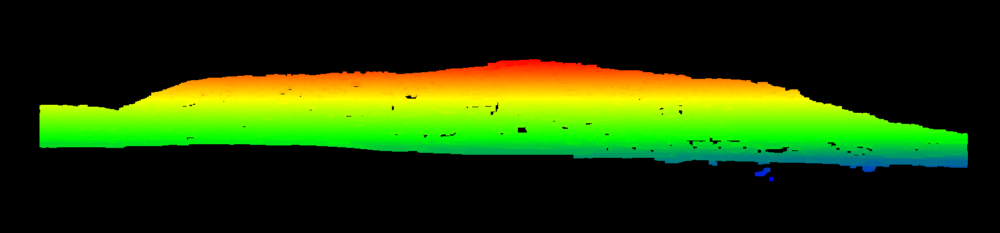
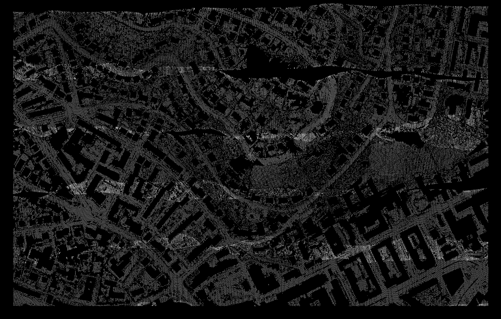

.. _ground:

===============================================================================
Identifying ground returns
===============================================================================

One of the most commonly used tasks within the PDAL application is that of
segmenting ground returns in point cloud datasets. The goal of this tutorial is
to share several of the options within PDAL for completing this task.

To run the examples in this tutorial, download the dataset `CSite1_orig-utm.laz
<https://raw.github.com/PDAL/data/master/isprs/CSite1_orig-utm.laz>`_ and save
it to disk.

Simple Morphological Filter
------------------------------------------------------------------------------

The Simple Morphological Filter (SMRF) is one of two ground filters available
via PDAL [Pingel2013]_. SMRF options can be found in the :ref:`<filters.smrf>`
documentation.

In each of the examples in this section, we will call the following ``pdal
translate`` command. Simply create the ``pipeline.json`` according to each
example and update the path as necessary.

::

    $ pdal translate -i /path/to/CSite1_orig-utm.laz \
        -o /path/to/output.laz \
        --json /path/to/pipeline.json

The first example uses all default options for SMRF, with no preprocessing. The
only additional filter used in the pipeline is a :ref:`<filters.range>` stage.
This is not required, but is included to crop only returns classified as ground
for visualization purposes.

.. literalinclude:: smrf-range.json

The output is shown below.

.. image:: csite-smrf-default.png
   :height: 400px

When viewed from the side, it is apparent that there are a number of low noise
points that can negatively impact many ground segmentation approaches.

We can insert the :ref:`<filters.outlier>` stage before SMRF to mark noise
points with a Classificaiton value of 7 (:ref:`<filters.elm>` should do a
reasonable job in this instance too). SMRF can then be told to ignore all
points with a Classification of 7.

.. literalinclude:: outlier-smrf-range.json

The result is shown below.

Finally, large buildings can be problematic with many ground segmentation
methods. One tool that SMRF provides to combat this is the ``cut`` parameter.
We set ``cut`` to 20 to see if we can improve the segmentation (perhaps most
notably the large structure in the lower right corner).

.. literalinclude:: outlier-smrf-range-cut.json

The updated run successfully removes the large building (at the expense of
terrain at the top of the hill in the top-center portion of the scene).

.. image:: csite-smrf-cut.png
   :height: 400px

Progressive Morphological Filter
------------------------------------------------------------------------------

PMF [Zhang2003]_.

filters.pmf :ref:`pmf <filters.pmf>`

pdal ground -i ~/Data/bare_earth_eval/isprs/converted/laz/CSite1_orig-utm.laz -o ~/Temp/ground-kernel-defaults.laz -v4
pdal ground -i ~/Data/bare_earth_eval/isprs/converted/laz/CSite1_orig-utm.laz -o ~/Temp/ground-kernel-defaults.laz --verbose 4
pdal ground -i ~/Data/bare_earth_eval/isprs/converted/laz/CSite1_orig-utm.laz -o ~/Temp/ground-kernel-defaults.laz --extract --verbose 4
pdal ground -i ~/Data/bare_earth_eval/isprs/converted/laz/CSite1_orig-utm.laz -o ~/Temp/ground-kernel-denoise.laz --extract --denoise --verbose 4
pdal ground -i ~/Data/bare_earth_eval/isprs/converted/laz/CSite1_orig-utm.laz -o ~/Temp/ground-kernel-denoise-cell.laz --extract --denoise --cell_size=1.5 --verbose 4

A complete description of the algorithm can be found in the article `"A
Progressive Morphological Filter for Removing Nonground Measurements from
Airborne LIDAR Data" <http://users.cis.fiu.edu/~chens/PDF/TGRS.pdf>`_ by K.
Zhang, S. Chen, D. Whitman, M. Shyu, J. Yan, and C. Zhang.

We have chosen to demonstrate the algorithm using data from the 2003 report
"ISPRS Comparison of Filters." For more on the data and the study itself,
please see http://www.itc.nl/isprswgIII-3/filtertest/ as well as `"Experimental
comparison of filter algorithms for bare-earth extraction from airborne laser
scanning point clouds" <http://dx.doi.org/10.1016/j.isprsjprs.2004.05.004>`_ by
G. Sithole and G. Vosselman.

Using the Ground kernel
------------------------------------------------------------------------------

The :ref:`pdal ground <ground_command>` kernel can be used to filter ground
returns, allowing the user to tweak filtering parameters at the command-line.

Let's start by running ``pdal ground`` with the default parameters.

::

    $ pdal ground -i CSite1_orig-utm.laz -o CSite1_orig-utm-ground.laz

To get an idea of what's happening during each iteration, you can optionally
increase the verbosity of the output. We'll try ``-v4``.  Here we see a summary
of the parameters, along with height threshold, window size, and number of
remaining ground points.

::

    $ pdal ground -i CSite1_orig-utm.laz -o CSite1_orig-utm-ground.laz -v4
    
The resulting filtered cloud can be seen below.

To address, we introduce an alternate way to call PMF

The result is noticeably cleaner in both the top-down and front views.

Unfortunately, you may notice that we still have a rather large building in the
lower right of the image. By tweaking the parameters slightly, in this case,
increasing the cell size, we can do a better job of removing such features.

Once again, the result is noticeably cleaner.

